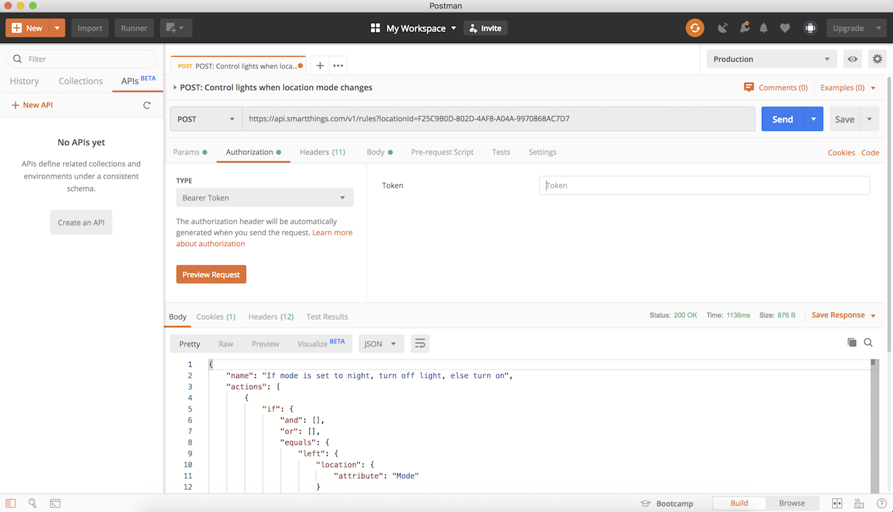
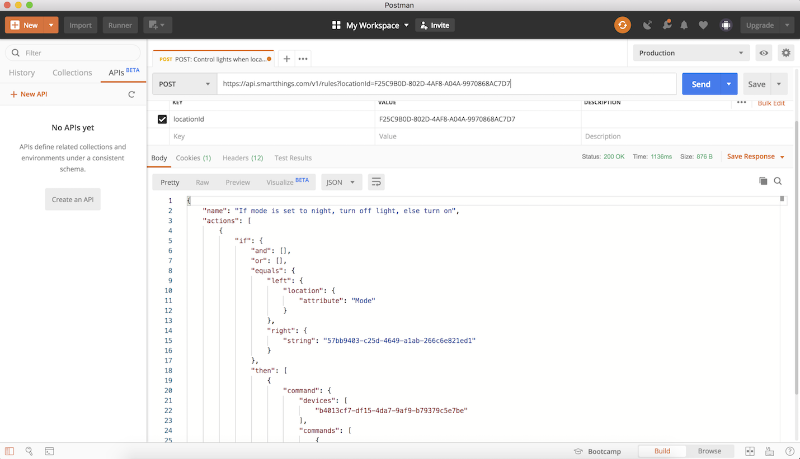
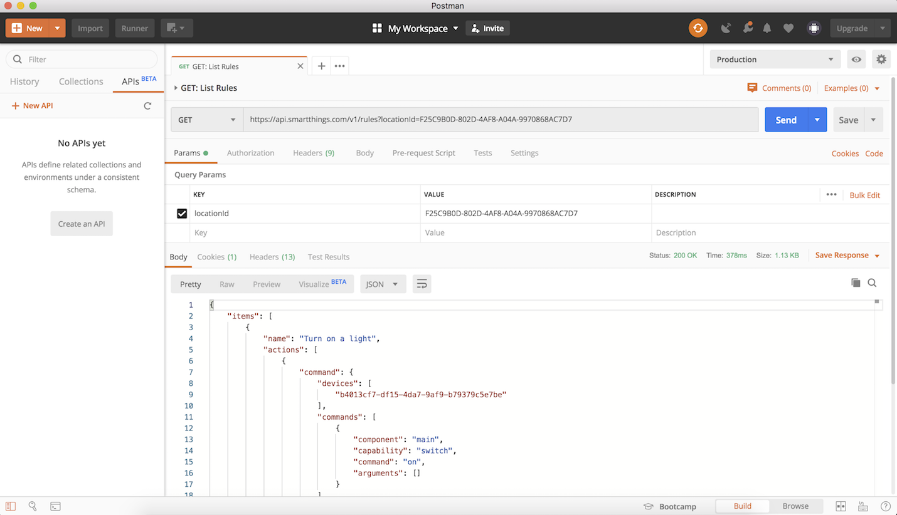
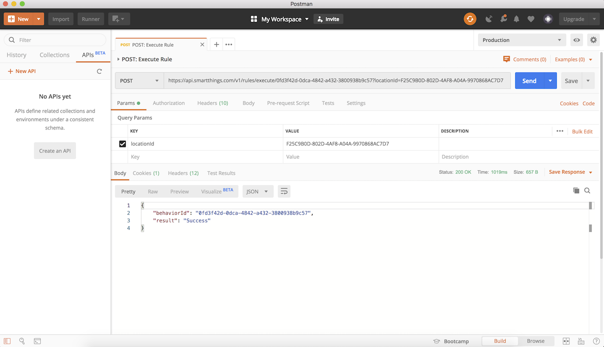

# Working with Rules

The Rules API enables the developer to create automations, both simple and complex, that can operate on the SmartThings cloud. In a future release of the API, local execution of rules on the SmartThings hub will be supported, making Rules API a great choice for those looking to create fast, stable, and secure automations.  

Using the Rules API the developer can create automations such as:
 * Turning on all your lights when your door opens
 * Turning off all your lights at a certain time of day
 * Changing your location mode to away when all presence detection devices are not present

With this quick overview we will provide you with the basics for creating your first rules. Please take a look at [Rules Breakdown](rules-breakdown.html) to get a more in depth look at how rules operate and the possibilities unlocked with the API.

## Interaction with the SmartThings Cloud

- Use the [Rules API](https://smartthings.developer.samsung.com/docs/api-ref/st-api.html#tag/rules) to work with rules.

- Personal access tokens require rules scopes. See [Authorization and Permissions](https://smartthings.developer.samsung.com/docs/auth-and-permissions.html).

- Rate limits and guardrails apply for rules. Also note that rules are subject to the same rate limits as `Apps`. See [Rate Limits](https://smartthings.developer.samsung.com/docs/rate-limits.html)

## Example with Postman

For this example, we will create an automation that will turn off a light when we change our location mode to `Night` and turn on the light if we set our location mode to `Home` or `Away`. Make sure you have a switch connected to your account or a virtual device created for this test. You will also need to obtain the Device ID for the device you will use in this rule. In this example we will use the [Rules API](../api-ref/st-api.html#tag/rules) to create the automation. 

### Install Postman

Install the [Postman app](https://www.getpostman.com/) and create a Postman account for yourself (a free account is sufficient for this example).

### Obtain SmartThings personal access token

- If you don't have it already, open your Samsung account.

- Next, get a personal access token for calling the SmartThings API. You will use this as a bearer token in the Postman app. Go to the [personal access tokens page](https://account.smartthings.com/tokens) and click on the **Generate new token** on the top right.

Make sure that you select **Rules > Read all rules**, **Rules > Write all rules**, **Rules > Execute all rules**, **Devices > Read devices** and **Locations > Read locations** for **Authorized Scopes**.

### Obtain Device IDs, Location ID and location Mode IDs for use in Rules

- In Postman make a request to the [Devices API](https://smartthings.developer.samsung.com/docs/devices/device-basics.html) to get a list of devices and their IDs. 

- In Postman make a request to the [Location API](https://smartthings.developer.samsung.com/docs/locations/locations-overview.html) to get a list of locations and a Location ID. 

- In Postman make a request to the [Location API](https://smartthings.developer.samsung.com/docs/locations/locations-overview.html) to get a list of the location Modes.

### Create a Rule

To create a rule with Postman, send a POST request to `https://api.smartthings.com/rules?locationId=C955F1C2-CE6B-49CA-99B7-B28B7FC493C6`.

- Start Postman. In the **Authorization** section of the Postman window, for the **TYPE** field, select **Bearer Token** from the drop-down menu list. This will display the **Token** form field on the right. Copy and paste here the personal access token that you generated above.

[](img/post-rules-auth.png?align=center)

- In the Postman window, select **POST** and type in the following url: `https://api.smartthings.com/rules?locationId=C955F1C2-CE6B-49CA-99B7-B28B7FC493C6`.

- In the Postman window, select **Body** and then click **raw** and then to the right select **JSON** from the drop down.

Here is our POST request body to create a rule that will turn off a light if our location mode is changed to `Night`, otherwise it will turn the light on if the location mode is changed to any other state (by default this would be `Home` and `Away`).

```json
{
	"name": "Control lights when location mode changes.",
	"actions": [{
		"if": {
			"equals": {
				"left": {
					"location": {
						"attribute": "Mode"
					}
				},
				"right": {
					"string": "a89a6ad7-929f-4f64-b0ce-8bdf83026982"
				}
			},
			"then": [{
				"command": {
					"devices": [
						"d89a6ad7-929f-4f64-b0ce-8bdf83026984"
					],
					"commands": [{
						"component": "main",
						"capability": "switch",
						"command": "off"
					}]
				}
			}],
			"else": [{
				"command": {
					"devices": [
						"d89a6ad7-929f-4f64-b0ce-8bdf83026984"
					],
					"commands": [{
						"component": "main",
						"capability": "switch",
						"command": "on"
					}]
				}
			}]
		}
	}]
}
```

[](img/post-rules-ifaction.png?align=center)

With our new rule created via the Rules API, SmartThings will automatically turn on or off your light depending on the current setting of your Mode.

### Get the list of created Rules

To see the rules that you have created via the Rules API, again using Postman, send a GET request to `https://api.smartthings.com/rules?locationId=C955F1C2-CE6B-49CA-99B7-B28B7FC493C6`.

- Start Postman. In the **Authorization** section of the Postman window, for the **TYPE** field, select **Bearer Token** from the drop-down menu list. This will display the **Token** form field on the right. Copy and paste here the personal access token that you generated above.

- In the Postman window, select **GET** and type in the SmartThings API `https://api.smartthings.com/rules?locationId=C955F1C2-CE6B-49CA-99B7-B28B7FC493C6`.

[](img/get-rules-list.png?align=center)


### Execute Rules

- For complex Rules it may be helpful to execute the rule manually to ensure that it is performing as expected. In this case the execute api can be used to trigger your rule instead of waiting for an event to trigger the rule automatically.

To execute the Rule you created via the Rules API get it's ID by sending a GET request to `https://api.smartthings.com/rules?locationId=C955F1C2-CE6B-49CA-99B7-B28B7FC493C6`

- In the Postman window, select **POST** and type in the SmartThings API url: `https://api.smartthings.com/rules/execute/:ruleId?locationId=C955F1C2-CE6B-49CA-99B7-B28B7FC493C6`.

[](img/post-execute-rule.png?align=center)


# Rules API

Now that we've created our first Rule let's cover the Rules Grammar and review the types of actions that are available within the API.  

### Rule Body
A rule is described in JSON. A single rule can be used to represent complex rules. A rule has a name and a list of actions, which is a tree that is evaluated when the rule is triggered. 

Actions are a core primitive of the Rules API and define what a rule "does". One of the simplest actions is an "if" action. Let's first see an example of an `IfAction` and then we will break it apart.

```json
{
    "name": "If my door is opened then turn on my lights",
    "actions": [
        {
            "if": {
                "equals": {
                    "left": {
                        "device": {
                            "devices": [
                                "5F869A33-ECBC-43D8-AFAB-B1BA6D96E77E"
                            ],
                            "component": "main",
                            "capability": "contactSensor",
                            "attribute": "contact"
                        }
                    },
                    "right": {
                        "string": "open"
                    }
                },
                "then": [
                    {
                        "command": {
                            "devices": [
                                "420CC6DD-4DC6-497E-855A-48C1FCB70E61", "19306729-8D2F-4A68-820B-3172A43403F6", "995C0DFC-67EC-444C-8CD4-E7B2F3FEB9F4"
                            ],
                            "commands": [
                                {
                                    "component": "main",
                                    "capability": "switch",
                                    "command": "on",
                                    "arguments": []
                                }
                            ]
                        }
                    }
                ],
                "else": [
                ]
            }
        }
    ]
}
```

In this rule we introduce the idea of a `condition`. A condition is evaluated by the rule engine during execution. An `IfAction` takes a top level condition - in this case the `EqualsCondition`. The `EqualsCondition` requires `left` and `right` fields, these are evaluated for equality. In this specific case the `left` field will resolve to the value of the device's Contact Sensor capability. If it is set to open, then the `EqualsCondition` will evaluate to true and execute the actions defined in the `then` block. Otherwise if it is not set to open, then the actions in the `else` block will execute. (In this case this is a no op)

### Current List of Support Actions

- IfAction
- SleepAction
- CommandAction
- EveryAction

### Example Actions:

`SleepAction` is a type that can be used to introduce a pause between the execution of other actions. One example would be the case where you would like to turn on a light but then have that light turn off automatically after some time has elapsed. 

```json
{
    "name": "Turn on a light, after 1 Minute, turn the light off",
    "actions": [
        {
            "if": {
                "equals": {
                    "left": {
                        "device": {
                            "devices": [
                                "61902075-5932-4EF6-8EF7-5A9D8B7D9B28"
                            ],
                            "component": "main",
                            "capability": "motionSensor",
                            "attribute": "motion"
                        }
                    },
                    "right": {
                        "string": "active"
                    }
                },
                "then": [
                    {
                        "command": {
                            "devices": [
                                "945D4539-855B-44EA-9DF4-43407F482691"
                            ],
                            "commands": [{
                                "component": "main",
                                "capability": "switch",
                                "command": "on",
                                "arguments": []
                            }]
                        }
                    },
                    {
                        "sleep": {
                            "duration": {
                                "value": {
                                    "integer": 1
                                },
                                "unit": "Minute"
                            }
                        }
                    },
                    {
                        "command": {
                            "devices": [
                                "945D4539-855B-44EA-9DF4-43407F482691"
                            ],
                            "commands": [{
                                "component": "main",
                                "capability": "switch",
                                "command": "off",
                                "arguments": []
                            }]
                        }
                    }
                ]
            }
        }
    ]
}
```

In this rule we are chaining together a few different actions to complete our goal of turning a light on, pausing for one (1) minute and then turning it off. As you can see we are making use of an `IfAction` to trigger the rule execution when motion events occur for this device. When motion is active, three (3) actions will take place in sequence: 
1. Send the `on` command to light 1
2. Sleep for 1 minute
3. Send the `off` command to light 1

Rules containing an `EveryAction` can be used to setup automations that execute at a defined interval.

```json
{
    "name": "Every 10 minutes turn on a light",
    "actions": [
        {
            "every": {
                "interval": {
                    "value": {
                        "integer": 10
                    },
                    "unit": "Minute"
                },
                "actions": [
                    {
                        "command": {
                            "devices": [
                                "FE7AD97B-F45A-4298-BAA0-39A9A2F56A99"
                            ],
                            "commands": [{
                                "component": "main",
                                "capability": "switch",
                                "command": "on",
                                "arguments": []
                            }]
                        }
                    }
                ]
            }
        }
    ]
}
```

`EveryAction` also supports a `specific` option as well. In this case we can create a rule where we turn on a light at a given time each day. The `reference` field allows for a number of options: (`Now`, `Sunrise`, `Noon`, `Sunset`, `Midnight`). You can then use the `offset` to fine tune the time to execute at an exact time every day. 

```json
{
	"name": "Turn on a light at 8:45 am",
	"actions": [
		{
			"every": {
				"specific": {
					"reference": "Noon",
					"offset": {
						"value": {
							"integer": -195	
						},
						"unit": "Minute"
					}
				},
				"actions": [
					{
						"command": {
							"devices": ["5C362438-E463-4BA9-9A3A-50AFFA597694"],
							"commands": [ {
								"component": "main",
								"capability": "switch",
								"command": "on"
							}]
						}
					}	
				]
			}
		}	
	]
}
```

Beyond the `EqualsCondition` used earlier, the Rules API supports a number of different conditions. These include: `GreaterThanCondition`, `LessThanCondition`, `GreaterThanOrEqualsCondition`, `LessThanOrEqualsCondition`, and `BetweenCondition`

```json
{
    "name": "If a light's level is greater than 50 set location mode to Home",
    "actions": [
        {
            "if": {
                "greater_than": {
                    "left": {
                        "integer": 50
                    },
                    "right": {
                        "device": {
                            "devices": ["15E8ED60-422A-45D7-91A6-131502BE77ED"],
                            "component": "main",
                            "capability": "switchLevel",
                            "attribute": "level"
                        }
                    }
                },
                "then": [
                    {
                        "location": {
                             "mode": "D6537244-04DA-4B8F-A278-66AE7DB24481"
                        }
                    }
                ]
            }
        }
    ]
}
```

Rather than check if the level of the light is greater than or less than we can further restrict that condition with the `BetweenCondition`, checking that the light's level is between two provided values.
```json
{
    "name": "If the light is between 1 and 50 then set location mode to away",
    "actions": [
        {
            "if": {
                "between": {
                    "value": {
                        "device": {
                            "devices": ["0746171B-DF74-4C57-8B1B-6676AB449C71"],
                            "component": "main",
                            "capability": "switchLevel",
                            "attribute": "level"
                        }
                    },
                    "start": {
                        "integer": 1
                    },
                    "end": {
                        "integer": 50
                    }
                },
                "then": [
                    {
                        "location": {
                             "mode": "D6537244-04DA-4B8F-A278-66AE7DB24481"
                        }
                    }
                ]
            }
        }
    ]
}
```

`CommandActions` support sending commands to device(s) to control their state. In the Rules API you will provide the devices id's that you want to control as well as a list of commands. In the following example we are using the `colorControl` capability and the `setColor` command along with arguments to change the color of a light bulb. To learn more about the types of capabilities available view the [Capabilities Reference](../api-ref/st-api.html#tag/capabilities).
```json
{
	"name": "If switch is turned on then turn light red.",
	"actions": [{
		"if": {

			"equals": {
				"left": {
					"device": {
						"devices": ["0184D5F5-FC6B-473A-89A9-12F32747B50D"],
						"component": "main",
						"capability": "switch",
						"attribute": "switch"
					}
				},
				"right": {
					"string": "on"
				}
			},
			"then": [{
				"command": {
					"devices": ["CEE36D71-9375-4D3D-BD0B-F70208933A89"],
					"commands": [{
						"component": "main",
						"capability": "colorControl",
						"command": "setColor",
						"arguments": [{
							"map": {
								"saturation": {
									"integer": 240
								},
								"hue": {
									"integer": 100
								}
							}

						}]
					}]
				}
			}]
		}
	}]

}
```


# Rules Glossary

## Actions:
 
### CommandAction
Send command(s) to device(s).

### EveryAction
Perform actions based on an interval specified in the rule.

### IfAction
Perform actions based on the result of a boolean condition evaluation.

### LocationAction
Set the location mode.

### SleepAction
Allows for adding a delay during the processing of other actions provided in the rule.

-------------

## Conditions:

### EqualsCondition
Checks for equal values. ex: If my Bedroom Switch is on.

```json
"equals": {
    "left": {
        "device": {
            "devices": ["9277539C-0D51-4CF6-813D-E96017F70E29"],
            "component": "main",
            "capability": "switch",
            "attribute": "switch"
        }
    }, 
    "right": {
        "string": "on"
    }
}

```

### GreaterThanCondition
Checks if a value is greater than a provided value. ex: If a light's level is larger than a given value.

```json
"greater_than": {
    "left": {
        "integer": 50
    },
    "right": {
        "device": {
            "devices": ["15E8ED60-422A-45D7-91A6-131502BE77ED"],
            "component": "main",
            "capability": "switchLevel",
            "attribute": "level"
        }
    }
}
```

### GreaterThanOrEqualsCondition
Checks if a value is greater than or equal to a provided value. ex: If a light's level is larger to equal to a given value.

```json
"greater_than_or_equals": {
    "left": {
        "integer": 50
    },
    "right": {
        "device": {
            "devices": ["15E8ED60-422A-45D7-91A6-131502BE77ED"],
            "component": "main",
            "capability": "switchLevel",
            "attribute": "level"
        }
    }
}
```

### LessThanCondition
Checks if a value is less than a provided value. ex: If a light's level is less than a given value.

```json
"less_than": {
    "left": {
        "integer": 50
    },
    "right": {
        "device": {
            "devices": ["15E8ED60-422A-45D7-91A6-131502BE77ED"],
            "component": "main",
            "capability": "switchLevel",
            "attribute": "level"
        }
    }
}
```

### LessThanOrEqualsCondition
Checks if a value is less than or equal to a provided value. ex: If a light's level is less than or equal to a given value.

```json
"less_than_or_equals": {
    "left": {
        "integer": 50
    },
    "right": {
        "device": {
            "devices": ["15E8ED60-422A-45D7-91A6-131502BE77ED"],
            "component": "main",
            "capability": "switchLevel",
            "attribute": "level"
        }
    }
}
```

### BetweenCondition
Checks if a value is between the provided values.

```json
"between": {
    "value": {
        "device": {
            "devices": ["0746171B-DF74-4C57-8B1B-6676AB449C71"],
            "component": "main",
            "capability": "switchLevel",
            "attribute": "level"
        }
    },
    "start": {
        "integer": 50
    },
    "end": {
        "integer": 75
    }
}
```

-------------

## Operands:

### DeviceOperand
Allows for the use of the state of a device to act as a condition.

### LocationOperand
Allows for the use of the location mode state to act as a condition

### ArrayOperand
Allows for evaluation of multiple operands. 

-------------

## Misc Rule API Terms

### Trigger
In the Rules API a trigger acts as a way to start the execution of a rule. When we create a rule with an `EqualsCondition` that uses a `DeviceOperand` the device being used will then act as a trigger for the rule. In the example that follows the switch in the `EqualsCondition` is the trigger. When that device is used the rule engine will then evaluate the `EqualsCondition` and determine if it can proceed to execute the rule.

```json
{
	"name": "Turn on lights when switch is turned on.",
	"actions": [
	{
		"if": {

			"equals": {
				"left": {
					"device": {
						"devices": ["2CFC68C5-95A6-477C-804C-8704E3A161DF"],
						"component": "main",
						"capability": "switch",
						"attribute": "switch"
					}
				},
				"right": {
					"string": "on"
				}
			},
			"then": [
				{
					"command": {
						"devices": ["4269AC7F-5B05-4B17-B5BD-86FDB0577912", "6A62F2C6-AA00-4E95-AD28-F060AEBC200E"],
						"commands": [{
							"component": "main",
							"capability": "switch",
							"command": "on"
						}]
					}
				}
			]
		}
	}
	]

}
```
